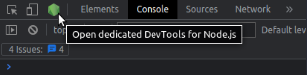
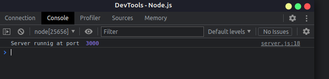
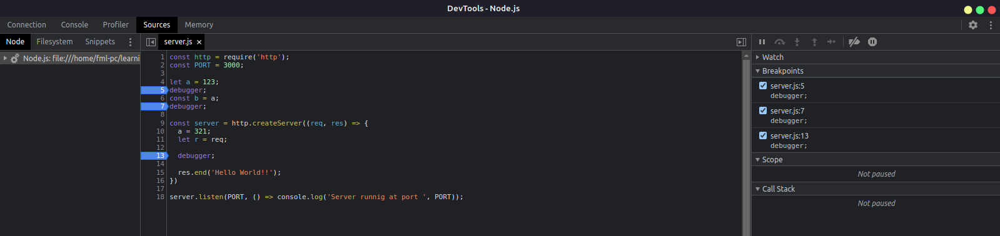
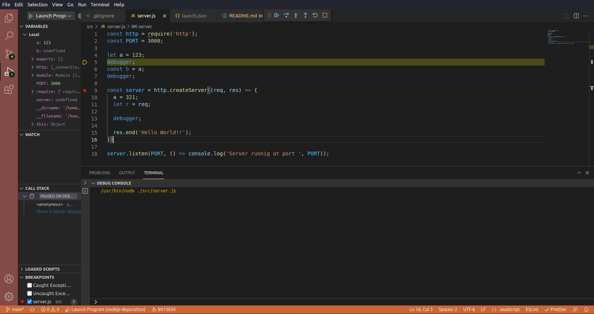

# Nodejs Depuration
> Nodejs depuration instructions with **inspect**. Show how make depuration with nodejs with the native tools

## Console

**Inspector Client**
- Start application with inspect option: `node inspect src/server.js`

**Debbug**
- Put `debugger` key word on your code line, where you want to check step.
  ```js
  let a = 123;
  debugger;
  const b = a;
  debugger;
  ```
- Type `c` and press `enter` to continue.
  ```bash
  debug> c
  ```
- Type the function `list(<line-numbers-of-file>)` to show file part.
  ```bash
  debug> list(100)
  ```
- Check variables content with `exec <variable-name>`.
  ```bash
  debug> exec a
  ```
- Exit press `Ctrl+c` twice.
- Also, type `r` and press `enter` to restart depuration.
  ```bash
  debug> r
  ```
- Use `s` and press `enter` go to next step.
  ```bash
  debug> s
  ```
- User `o` and press `enter` go to back step.
  ```bash
  debug> o
  ```
- Set watchers with `watch(<expression>)` to monitore values.
  ```bash
  debug> watch('a')
  debug> watch('a > 2')
  debug> r
  ```

## Browser

Start application with command:
```bash
node --inspect src/server.js
```
You'll be able to access on Chrome Dev could see:







## VsCode

In `.vscode` dir, create file named `launch.json` with the content:
```json
{
  "version": "0.2.0",
  "configurations": [
    {
      "name": "Launch Program",
      "program": "${workspaceFolder}/src/server.js",
      "request": "launch",
      "skipFiles": [
        "<node_internals>/**"
      ],
      "type": "node"
    }
  ]
} 
``` 
Go to the file `src/server.js`, set break point and press `F5`:




**References**
- https://nodejs.org/dist/latest-v16.x/docs/api/debugger.html
- https://nodejs.org/en/docs/guides/debugging-getting-started
- https://youtube.com/watch?v=lx_zZvz5MFY&ab_channel=ErickWendel